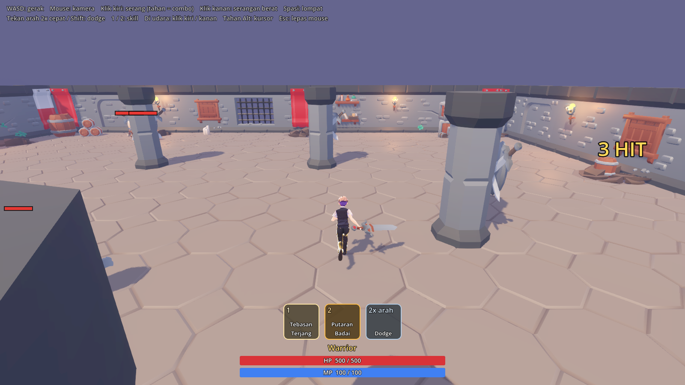
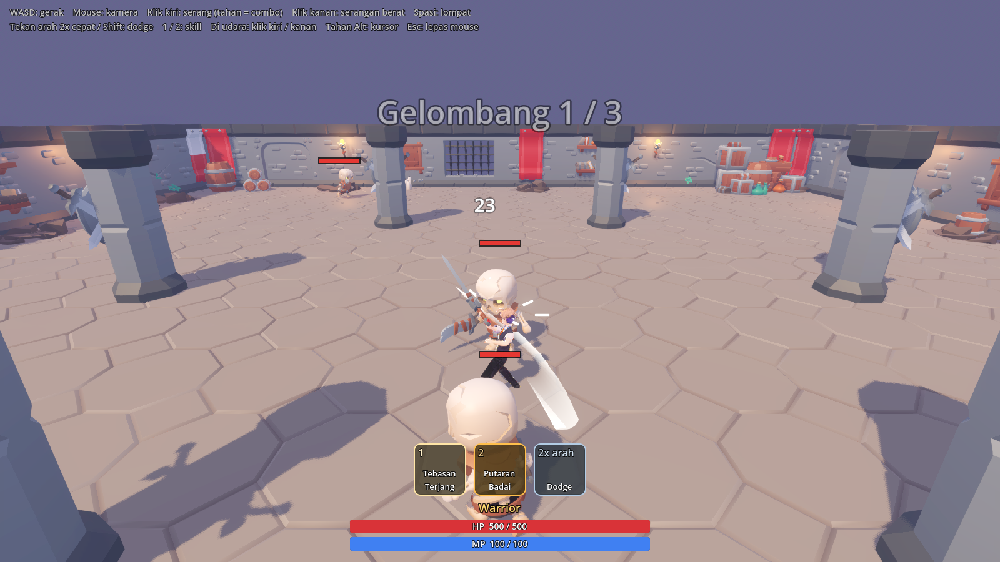

# Darago

Prototype action RPG 3D bergaya anime, terinspirasi rasa Dragon Nest klasik:
combat cepat berbasis combo, dodge, lompat + serangan udara, skill, dan musuh
dengan tanda serangan yang bisa dihindari. Dibuat dengan Godot 4.7.2 (GDScript).




Semua aset pihak ketiga berlisensi bebas (CC0 / MIT); daftar lengkapnya di
[game/CREDITS.md](game/CREDITS.md). Tidak ada aset, nama, atau desain dari
Dragon Nest.

## Menjalankan

1. Unduh **Godot 4.7.2 Standard** (bukan .NET) untuk Windows dari
   https://godotengine.org/download/archive/4.7.2-stable/
2. Ekstrak `Godot_v4.7.2-stable_win64.exe` (dan `_console.exe`) ke folder
   `tools/godot/`.
3. Klik dua kali **`Main Game.bat`** untuk main, atau **`Buka Editor.bat`**
   untuk membuka editor. Pembukaan pertama butuh waktu untuk mengimpor aset.

Tanpa file .bat: buka `game/project.godot` dengan Godot 4.7.2.

## Kontrol

| Tombol | Aksi |
|---|---|
| WASD + mouse | gerak dan kamera (karakter menghadap arah kamera) |
| Klik kiri (tahan) | combo 3 tebasan |
| Klik kanan | tebasan naik (melempar musuh ke udara) |
| Spasi | lompat; di udara klik kiri = combo udara, klik kanan = hantaman terjun |
| Tekan arah 2x cepat (atau Shift) | dodge |
| 1 / 2 | skill Tebasan Terjang / Putaran Badai |
| Tahan Alt / Esc | kursor mouse |
| `\` | screenshot (tersalin ke clipboard + disimpan di `screenshots/`) |

## Struktur

- `game/scripts/` kode (player, musuh, kamera, HUD, efek, arena)
- `game/data/` angka yang bisa diubah di Inspector: class (`classes/warrior.tres`),
  serangan (`attacks/`), musuh (`enemies/`)
- `game/assets/` model, animasi, dan potongan dungeon
- `game/tests/` test otomatis dan alat bantu

## Test

```
tools/godot/Godot_v4.7.2-stable_win64_console.exe --headless --path game --fixed-fps 60 -- --smoke-test
tools/godot/Godot_v4.7.2-stable_win64_console.exe --path game -- --fps-probe
```

## Catatan teknis

`game/addons/vrm` (godot-vrm v2.6.1) ditambal supaya model VRM 0.x menghadap +Z
saat retarget; tanpa itu gerakan lengan animasi terbalik. Lihat penanda
`DARAGO PATCH` dan [game/CREDITS.md](game/CREDITS.md).
